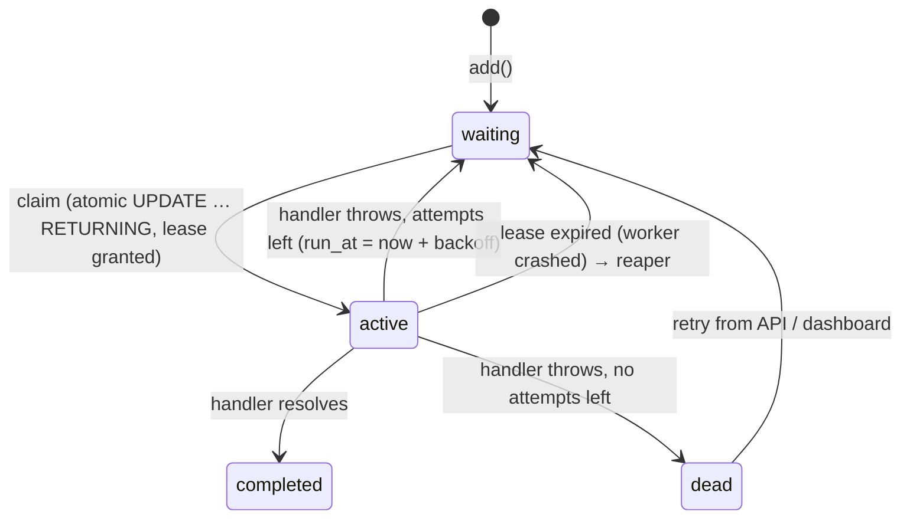

# TaskForge

[](https://github.com/OWNER/taskforge/actions/workflows/ci.yml)

A durable background job queue for Node.js, written in TypeScript and backed by SQLite. It has **no external services and no native dependencies**. It uses Node's built-in `node:sqlite`.

It covers the parts of job processing that are hard to get right: **at-least-once delivery, retries with exponential backoff and jitter, priorities, delayed jobs, crash recovery through leases and heartbeats, fencing against stale workers, dead-letter handling, deduplication, timeouts, and graceful shutdown**. It also ships a REST API and a live dashboard.

```ts
import { JobStore, Queue, Worker } from 'taskforge';

const store = new JobStore({ path: 'jobs.db' });
const emails = new Queue<{ to: string }>('emails', store);

emails.add('welcome', { to: 'ada@example.com' }, {
  priority: 10,
  maxAttempts: 5,
  backoff: { type: 'exponential', delayMs: 1000, maxDelayMs: 60_000, jitter: true },
  dedupeKey: 'welcome:ada',
});

new Worker('emails', store, async (job, ctx) => {
  await sendEmail(job.payload.to, { signal: ctx.signal });
  return { sent: true };
}, { concurrency: 5, timeoutMs: 10_000 }).start();
```

## Quick start

```bash
npm install
npm test          # 31 tests: store, worker, and HTTP API
npm run demo      # live dashboard at http://localhost:3000
npm run bench     # throughput benchmark
```

The demo runs two queues whose handlers fail at random, so you can watch retries, backoff, delayed jobs, and dead-lettering happen live in the dashboard.

## How it works



### Design decisions

| Problem | Approach |
|---|---|
| **Two workers grabbing the same job** | Each claim is a single `UPDATE … WHERE id = (SELECT … LIMIT 1) RETURNING *` statement, so it is atomic. SQLite serializes writers, so exactly one worker wins. |
| **A worker crashes mid-job** | A claim is a *lease* (`locked_until`), not a permanent lock. A reaper returns expired leases to the queue, or dead-letters the job if it has used all its attempts. |
| **A long job looks crashed** | The worker renews the lease with a heartbeat every `leaseMs / 3`, so a healthy long-running job is never reaped. |
| **A slow "zombie" worker finishes after its job was taken over** | Every completion, failure, and heartbeat is *fenced* on `worker_id`. The stale worker's write matches 0 rows and is discarded (the `lost` event). |
| **Many jobs failing at once and retrying together** | Exponential backoff with **full jitter** (`random(0, min(cap, base·2ⁿ))`) spreads the retries out. |
| **Hung handlers** | A per-job `timeoutMs` aborts the job's `AbortSignal` and records a failure. |
| **Duplicate submissions** | An optional `dedupeKey`, enforced by a partial unique index, returns the existing job instead of creating a second one. |
| **Deploys and restarts** | `worker.stop()` stops claiming new jobs and waits for in-flight jobs to finish. The demo wires this to `SIGINT`/`SIGTERM`. |
| **Fast polling at scale** | A composite index `(queue, status, priority DESC, run_at, id)` matches the claim query's `ORDER BY` exactly. WAL mode lets readers (the dashboard) run alongside writers. |

Delivery is **at-least-once**: a job is marked complete only after its handler resolves. Handlers should be idempotent, and `dedupeKey` helps on the producer side.

## Benchmark

On a Windows laptop with Node 22 and a file-backed SQLite database in WAL mode, running no-op handlers:

```
jobs:        20,000
enqueue:     781 ms    (~25,600 jobs/s, batched in one transaction)
process:     7,623 ms  (~2,600 jobs/s, concurrency 16, each state change durable on disk)
```

## REST API

| Method | Path | Description |
|---|---|---|
| `GET` | `/api/queues` | All queues with counts (waiting, delayed, active, completed, dead) |
| `POST` | `/api/queues/:queue/jobs` | Enqueue `{ name, payload, priority?, delayMs?, maxAttempts?, backoff?, dedupeKey? }` |
| `GET` | `/api/queues/:queue/jobs?status=&limit=&offset=` | List jobs |
| `GET` | `/api/queues/:queue/stats` | Counts for one queue |
| `GET` | `/api/jobs/:id` | One job, including result and last error |
| `POST` | `/api/jobs/:id/retry` | Requeue a dead job with a fresh attempt budget |

All input is validated, and errors return `{ error }` with a 4xx status.

## Project layout

```
src/
  store.ts    SQLite schema, atomic state transitions, reaper, fencing
  worker.ts   Concurrency-limited consumer: leases, heartbeats, timeouts, graceful shutdown
  queue.ts    Producer API (add, addBulk, stats, retry, clean)
  backoff.ts  Fixed / exponential backoff with full jitter
  server.ts   Express 5 REST API + static dashboard
public/       Dashboard (vanilla JS, live-updating, dark mode)
test/         Vitest suites for the store (deterministic clock), worker, and API
examples/     demo.ts, bench.ts
```

## License

MIT
